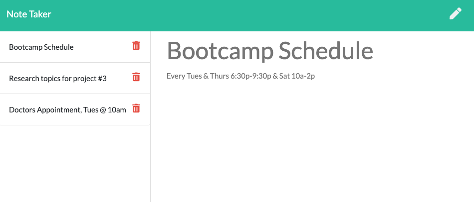
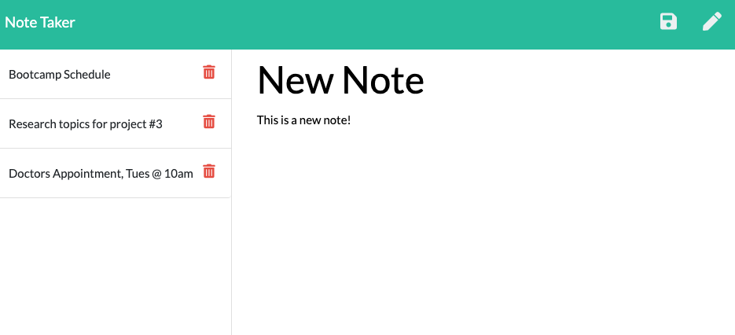

# Express.js_NoteTaker

## Description

This is a Note Taker App that can be used to write and save notes. This application uses an Express.js back end to save and retrieve note data from a JSON file using the `fs` module, which is displayed on the front-end and accessible for multiple user sessions. In addition, this app uses the npm package [Nano ID](https://www.npmjs.com/) to generate a `unique id` for each note. 

This application is deployed to Heroku: [Note Taker App](https://notetaker-expressjs.herokuapp.com/)

Link to GitHub Repository: [Express.js_NoteTaker](https://github.com/rdevans87/Express.js_NoteTaker)
 

 ## User Story

```
AS A small business owner
I WANT to be able to write and save notes
SO THAT I can organize my thoughts and keep track of tasks I need to complete
```

## Mock-Up

The following images show the web application's appearance and functionality: 

First Note:

  

New Note:

  

Saved Note:

  


## Demo Video

The following video demonstrates the web applications funcionality: [Note Taker Demo](https://drive.google.com/file/d/14IB8xYeklFeEI82DJ9-UiBAISYUzqHY0/view)


## Installation

  To run this app, install `node.js` from npm.

  `CD` into the folder where you cloned your fork.

  Add `.gitignore` to store `node_modules` in local directory.

  type `npm init` to create `package.json`
   
   `npm i express` to install `Express.js`

  `npm i nanoid` to install [Nano ID]() unique ID generator
    
  type `node server.js` run server `localhost:3000`

  App is listening on `PORT: 3000`

  

## Usage 

Paste the URL `http://localhost:3000/` into a web browser. 

You will be presented with a `landing page`.

Click on a link to the `notes page`.

Enter a new note title and the note’s text. Click on the `Save icon` 

Click on the `Write icon` in the navigation at the top of the page.

Enter a new note and save.

Click on `Delete icon` in the left column to remove a note.


## Acceptance Criteria

```
GIVEN a note-taking application
WHEN I open the Note Taker
THEN I am presented with a landing page with a link to a notes page
WHEN I click on the link to the notes page
THEN I am presented with a page with existing notes listed in the left-hand column, plus empty fields to enter a new note title and the note’s text in the right-hand column
WHEN I enter a new note title and the note’s text
THEN a Save icon appears in the navigation at the top of the page
WHEN I click on the Save icon
THEN the new note I have entered is saved and appears in the left-hand column with the other existing notes
WHEN I click on an existing note in the list in the left-hand column
THEN that note appears in the right-hand column
WHEN I click on the Write icon in the navigation at the top of the page
THEN I am presented with empty fields to enter a new note title and the note’s text in the right-hand column
```

## Issues 

I believe this application fulfills all the requirements listed in the [Acceptance Criteria](#acceptancecriteria)  however there are a few issues that I have not been able to resolve. Any feedback from the `central grader` regarding these issues would be much appreciated.

1. The application receives two errors specific on POST request:

```
Error in Terminal (POST)
ReferenceError: err is not defined
    at /Users/ryanevans/Express.js_NoteTaker/routes/apiRoutes.js:48:70
```
```
Error in DevTools (POST)
http://localhost:3000/api/notes 500 (internal server eror)
saveNote @ index.js: 37
handleNoteSave @ index.js: 74
```

2. I was unable to generate a unique ID with `nanoid` package when adding a new note to the application. The package was installed locally from the command line using `npm i nanoid` with import `const { nanoid } = require('nanoid')`, but I couldn't figure out how to properly apply it two the application.


## Grading Requirements

 * Technical Acceptance Criteria: 40%
 * Deployment: 36%
 * Application Quality: 11%
 * Repository Quality: 13%
 * Bonus: +10 Points
    - Application allows users to delete notes.  


## Submitted for Review

* The URL of the functional, deployed application.

* The URL of the GitHub repository. Give the repository a unique name and include a README describing the project.


[MIT License](LICENSE)


